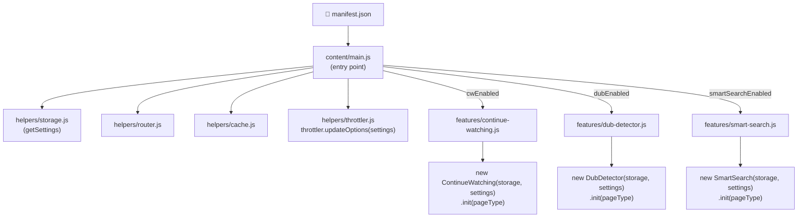
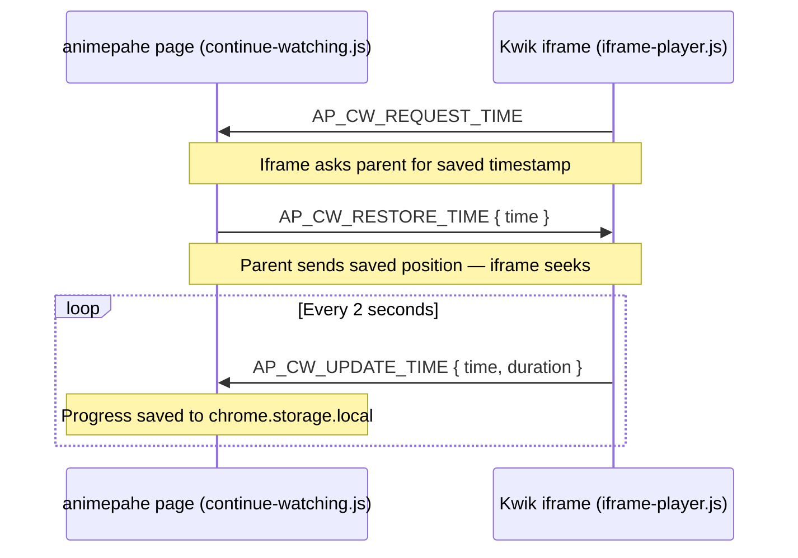
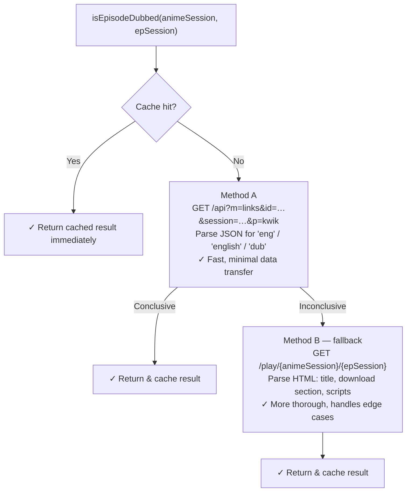
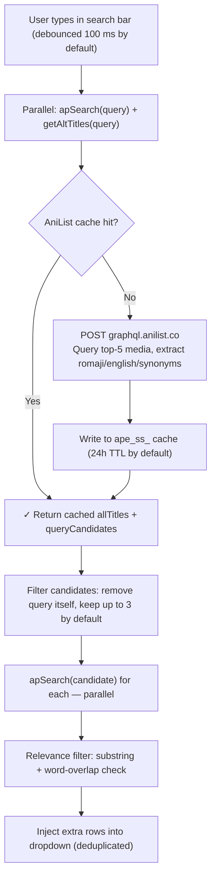

<a name="top"></a>

# animepahe Enhancer

> A lightweight browser extension that supercharges your animepahe experience — featuring automatic DUB detection, seamless Continue Watching with per-episode progress tracking, and Smart Search that finds anime by any alternative title via AniList.

<p align="center">
  
</p>
<p align="center">
  <a href="https://addons.mozilla.org/en-US/firefox/addon/animepahe-enhancer/"></a> <a href="https://microsoftedge.microsoft.com/addons/detail/omdenhapffjpbafkliiedijooomljbgd"></a>   
</p>

> [!WARNING]
> **Edge (v0.0.2) Bug Alert:** The current live Edge version has known issues. A fully patched update (**v0.1.0**) has been submitted and will automatically roll out to resolve these bugs as soon as Microsoft review completes.

## Table of Contents

|                                                                                                                                                                                                                                                            |                                                                                                                                                                                                                                                                                          |                                            |
| :--------------------------------------------------------------------------------------------------------------------------------------------------------------------------------------------------------------------------------------------------------- | :--------------------------------------------------------------------------------------------------------------------------------------------------------------------------------------------------------------------------------------------------------------------------------------- | :----------------------------------------- |
| ✨ **[Features](#features)** <br> &nbsp;&nbsp;↳ [Continue Watching](#-continue-watching) <br> &nbsp;&nbsp;↳ [DUB Detector](#-dub-detector) <br> &nbsp;&nbsp;↳ [Smart Search](#-smart-search) <br> &nbsp;&nbsp;↳ [Advanced Settings](#-advanced-settings)   | 📸 **[Screenshots](#screenshots)**                                                                                                                                                                                                                                                       | 📦 **[Installation](#installation)**       |
| ⚙️ **[Usage](#usage)** <br> &nbsp;&nbsp;↳ [Continue Watching](#continue-watching-1) <br> &nbsp;&nbsp;↳ [DUB Detector](#dub-detector-1) <br> &nbsp;&nbsp;↳ [Smart Search](#smart-search-1) <br> &nbsp;&nbsp;↳ [Popup Settings Panel](#popup-settings-panel) | 🏗️ **[Architecture](#architecture)** <br> &nbsp;&nbsp;↳ [File Structure](#file-structure) <br> &nbsp;&nbsp;↳ [How It Works](#how-it-works) <br> &nbsp;&nbsp;↳ [Adding a New Feature](#adding-a-new-feature) <br> &nbsp;&nbsp;↳ [Adding an Advanced Setting](#adding-an-advanced-setting) | 🔒 **[Permissions](#permissions)**         |
| 🌐 **[Supported Domains](#supported-domains)**                                                                                                                                                                                                             | 💻 **[Development](#development)**                                                                                                                                                                                                                                                       | 🤝 **[Contributing](#contributing)**       |
| 🔏 **[Privacy](#privacy)**                                                                                                                                                                                                                                 | 🔐 **[Security](#security)**                                                                                                                                                                                                                                                             | 🤝 **[Code of Conduct](#code-of-conduct)** |
| 📄 **[License](#license)**                                                                                                                                                                                                                                 |                                                                                                                                                                                                                                                                                          |                                            |

---

## Features

### ▶ Continue Watching

Never lose your place again. animepahe Enhancer tracks your exact playback position for every episode you watch and surfaces a **Continue Watching** row directly on the animepahe home page.

- Automatically saves your progress every 2 seconds by default (configurable) while the video plays
- Resumes exactly where you left off when you revisit an episode
- Displays a visual progress bar on each card in the Continue Watching grid
- Supports up to **24 episodes** by default in your watch history (FIFO — oldest entries are pruned automatically; this limit is configurable)
- Individual episodes can be removed with a hover-reveal ✕ button
- The entire list can be cleared in one click from the popup or the home page
- Works across all official animepahe mirror domains

### 🎙 DUB Detector

Instantly know which episodes are available in English dub without opening them. The DUB Detector automatically scans anime listings, episode pages, and the home feed and overlays colour-coded badges:

| Location        | Badge colour                                       | Example                        |
| --------------- | -------------------------------------------------- | ------------------------------ |
| Episode list    | Pink `DUB` badge / Orange `SUB ONLY` badge         | Dubbed or sub-only episode     |
| Home page cards | Pink `N/total` badge / Orange `SUB ONLY`           | `12/24` dubbed out of 24 total |
| Player page     | Inline `DUB` badge / `SUB ONLY` badge on the title | Confirmation when watching     |

Detection uses a two-method strategy with a local cache (24 hours by default, configurable) to minimise network requests:

1. **Lightweight JSON API check** — hits animepahe's `/api?m=links` endpoint
2. **HTML page fallback** — parses the play page if the API check is inconclusive

A smart **binary search** algorithm is used on episode lists, since dubbed episodes always form a contiguous block from the beginning of a series. This cuts the number of network requests from O(n) to O(log n). The number of parallel probes and the delay between scan batches are both configurable.

All network requests are routed through a **`RequestThrottler`** — a built-in rate-limiting layer that enforces configurable concurrency limits, per-request jitter, and exponential back-off with automatic retry on HTTP 429/503/403 responses, keeping scans polite without sacrificing speed. Every one of these knobs is exposed in the popup's [Advanced Settings](#-advanced-settings) panel.

<p align="right"><a href="#top">↑ Back to top</a></p>

### 🔍 Smart Search

Can’t find an anime because you only know its English dub title, a common nickname, or a romanized spelling that doesn’t match animepahe’s catalogue? Smart Search fixes that by querying [AniList](https://anilist.co) for every alternative title associated with your search term and running parallel searches for each one — all without leaving the search bar.

- Activates automatically as you type (debounced 100 ms by default) — no extra interaction required
- Fetches alternative titles (romaji, English, synonyms) from the AniList GraphQL API for the top matching anime
- Runs additional searches on animepahe using each candidate title and merges the results
- Extra results appear **above** the native dropdown, clearly labelled with a pink `also known as “…”` tag and a left-side accent border
- Duplicate titles already shown by animepahe’s native search are automatically suppressed
- Relevance filtering ensures only genuinely related titles are injected (word-overlap + substring checks)
- AniList lookup results are cached locally for 24 hours by default (prefix `ape_ss_`) — shares the same configurable cache-duration setting as the DUB Detector

<p align="right"><a href="#top">↑ Back to top</a></p>

### ⚙️ Advanced Settings

For anyone who wants to fine-tune exactly how the extension behaves, every internal timing, caching, and request-throttling value is exposed in a collapsible **Advanced Settings** panel inside the popup — no code editing required.

| Group                 | What's tunable                                                                                |
| --------------------- | --------------------------------------------------------------------------------------------- |
| **Continue Watching** | Max saved entries · cards shown before "Show More"                                            |
| **DUB Detector**      | Cache duration · binary-search probe count · delay between scan batches · homepage batch size |
| **Network Throttler** | Min request interval · jitter · max concurrent requests · max retries · base backoff          |
| **Smart Search**      | Minimum query length · debounce delay · max alternate titles queried · synonym query delay    |
| **Player**            | Progress-save interval                                                                        |

- Each setting has its own plain-language description, a numeric input clamped to a sane range, and an individual **↺ reset** button
- A **Reset All Advanced Settings** button restores every tunable above to its default in one click — without touching your feature toggles
- Collapsed by default to keep the popup simple for everyday users; click to expand
- Changes persist across browser restarts and (like the feature toggles) need a page reload to take effect

<p align="right"><a href="#top">↑ Back to top</a></p>

---

## Screenshots


<p align="right"><a href="#top">↑ Back to top</a></p>

---

## Installation

| Browser                                                                                                                                                              | Store                                                                                              | Notes                                                                                                                                                         |
| -------------------------------------------------------------------------------------------------------------------------------------------------------------------- | -------------------------------------------------------------------------------------------------- | ------------------------------------------------------------------------------------------------------------------------------------------------------------- |
|  **Firefox**                          | [Firefox Add-ons (AMO)](https://addons.mozilla.org/en-US/firefox/addon/animepahe-enhancer/)        | Requires Firefox 109.0+                                                                                                                                       |
|  **Microsoft Edge**         | [Edge Add-ons](https://microsoftedge.microsoft.com/addons/detail/omdenhapffjpbafkliiedijooomljbgd) | Desktop only                                                                                                                                                  |
|  **Other Chromium** | [GitHub Releases](https://github.com/abdullahkhfb/animepahe-enhancer/releases)                     | Manual install via Developer Mode — download `Animepahe-Enhancer.zip`, unzip, go to `chrome://extensions`, enable **Developer mode**, click **Load unpacked** |

<p align="right"><a href="#top">↑ Back to top</a></p>

---

## Usage

### Continue Watching

When you watch an episode on animepahe:

1. The extension automatically records your progress after the video starts playing. No manual action is required.
2. The next time you visit the **animepahe home page**, a **Continue Watching** section appears above the Latest Releases grid.
3. Each card shows:
   - The anime's poster thumbnail
   - A red progress bar at the bottom of the thumbnail indicating how far through the episode you are
   - The episode number badge (bottom-right of the thumbnail)
   - The anime title below the thumbnail
4. Click any card to jump directly back to that episode. The video will automatically seek to your saved position.
5. Hover over a card to reveal the **✕** remove button (top-right of the thumbnail) to remove that individual entry.
6. Use **Show More / Show Less** if you have more than 6 entries in your history.
7. Use **Clear All** (from the home page section or the popup) to wipe the entire list.

### DUB Detector

The DUB Detector runs automatically in the background on three page types:

**Anime episode list page (`/anime/{session}`):**

- All visible episode cards are scanned (using binary search) when the page loads.
- Dubbed episodes receive a pink **DUB** badge in the top-right corner of their card; sub-only episodes receive an orange **SUB ONLY** badge.
- A status pill appears in the bottom-right of the screen with real-time scan progress, including a live percentage indicator (e.g., `🎙 DUB: Scanning…  ·  42%`) that resolves to the final count on completion (e.g., `🎙 DUB: 12 episodes dubbed ✓`).
- The scan re-runs automatically when the episode list is paginated or updated via AJAX.

**Player page (`/play/{animeSession}/{epSession}`):**

- A quick check runs on load.
- If the episode is dubbed, a **DUB** badge is appended inline to the episode title (`<h1>`); otherwise a **SUB ONLY** badge is shown.
- The status pill shows `🎙 DUB: Dubbed ✓` or `🎙 DUB: Sub only`.

**Home page (latest releases grid):**

- Every anime card in the latest release feed is scanned.
- Cards with dubbed episodes receive a pink badge showing `dubbed/total` episodes (e.g., `12/24`).
- Scanning is batched (2 at a time by default) to avoid rate-limiting.

**Cache:** DUB results are cached in `chrome.storage.local` for **24 hours by default**. Stale entries are garbage-collected automatically 3 seconds after each page load. Both the batch size and cache duration are configurable in Advanced Settings, and you can force-clear the cache from the popup.

### Smart Search

Smart Search activates automatically while you type in the animepahe search bar—no extra steps are needed:

1. Start typing any title in the search bar. After a 100 ms debounce by default (configurable), Smart Search kicks in alongside the native search.
2. animepahe’s regular results appear as normal. Smart Search then queries AniList for alternative titles associated with your term.
3. Any additional matching anime found via those alternative titles are **injected at the top** of the dropdown under a labelled divider.
4. Each extra result card shows:
   - The anime’s poster thumbnail (circular)
   - The title as listed on animepahe
   - A pink _also known as “…”_ tag showing which search term led to this result
   - A pink left-side accent border to visually distinguish injected results
5. Click any result card (native or injected) to navigate to that anime’s page as normal.
6. If Smart Search finds nothing additional, the dropdown is left unchanged.

**Cache:** AniList lookup results are cached for **24 hours by default** (storage prefix `ape_ss_`, configurable in Advanced Settings). You can force-clear the cache from the popup.

### Popup Settings Panel

Click the extension icon in the browser toolbar to open the settings popup. From here you can:

- **Toggle Continue Watching** on or off
- **Toggle DUB Detector** on or off
- **Toggle Smart Search** on or off
- See how many items are currently in your Continue Watching list
- **Clear your Continue Watching list**
- See how many DUB detection results are currently cached
- **Clear the DUB cache** (forces a fresh scan on next visit)
- See how many Smart Search AniList lookups are currently cached
- **Clear the Smart Search cache** (forces fresh AniList lookups on next search)
- Expand **⚙️ Advanced Settings** to view and edit every internal tunable — grouped by feature, each with its own description, bounded input, and reset button

> After toggling a feature, reload the animepahe page for changes to take effect. The popup will show a reminder notice automatically.

#### Advanced Settings panel

Click **⚙️ Advanced Settings** (collapsed by default) to expand a panel covering 16 tunables across 5 groups — Continue Watching, DUB Detector, Network Throttler, Smart Search, and Player (see the [Advanced Settings](#-advanced-settings) feature section above for what each group controls).

- Every row shows a short plain-language explanation alongside a number input
- Out-of-range values are automatically clamped to that setting's min/max as you type or on blur
- Each row has its own **↺** button to reset just that one value to default
- **Reset All Advanced Settings** at the bottom resets every value above without touching your feature toggles
- Changes save instantly to `chrome.storage.local` and need a page reload to take effect, same as the feature toggles

<p align="right"><a href="#top">↑ Back to top</a></p>

---

## Architecture

### File Structure

```
📦 animepahe-enhancer/
├── ⚙️  manifest.json              # Extension manifest (Manifest V3)
│
├── 📁 content/
│   ├── 📄 main.js                 # Entry point — loads settings, detects page,
│   │                              #   dynamically imports and initializes features
│   ├── 📄 iframe-player.js        # Kwik iframe script — postMessage bridge
│   │
│   ├── 📁 features/               # One file per feature
│   │   ├── 📄 continue-watching.js  # Continue Watching — home row + player bridge
│   │   ├── 📄 dub-detector.js       # DUB Detector — badges, binary search, cache
│   │   └── 📄 smart-search.js       # Smart Search — AniList alt-title lookup + dropdown injection
│   │
│   └── 📁 helpers/                # Shared helpers imported by any feature
│       ├── 📄 storage.js          # chrome.storage.local wrapper + DEFAULT_SETTINGS
│       │                          #   + ADVANCED_SETTINGS_SCHEMA (drives the popup's panel)
│       ├── 📄 router.js           # Page-type detection from the current URL
│       ├── 📄 cache.js            # DUB cache read/write/GC (configurable TTL)
│       └── 📄 throttler.js        # RequestThrottler — rate-limiting, jitter, retry
│                                  #   (tunable at runtime via updateOptions())
│
├── 📁 popup/
│   ├── 🌐 popup.html              # Settings popup UI
│   ├── 🎨 popup.css               # Popup styles
│   └── 📄 popup.js                # Popup logic — toggles, stats, clear actions,
│                                  #   and the Advanced Settings panel (ES module;
│                                  #   imports ADVANCED_SETTINGS_SCHEMA from storage.js)
│
├── 📁 icons/
│   ├── 🖼️  icon16.{png,svg}
│   ├── 🖼️  icon48.{png,svg}
│   └── 🖼️  icon128.{png,svg}
│
└── 📁 .github/
    └── 📁 workflows/
        └── ⚙️  deploy.yml         # CI/CD: Unified production deployment engine
```

### How It Works

#### Module loading — no bundler required

`content/main.js` is the sole entry point registered in `manifest.json`. It uses the browser's native dynamic `import()` with `chrome.runtime.getURL()` to load feature and utility modules at runtime:



Feature files are listed in `web_accessible_resources` so the extension runtime can import them. No bundler, no build step — plain ES2020+ modules. Every feature constructor receives the same `settings` object (loaded once via `storage.getSettings()`), so reading a user-tuned value is just `settings.someKey ?? someDefault`.

#### Continue Watching — Cross-Frame Communication

animepahe embeds the actual video player in a sandboxed `<iframe>` served from a separate domain (Kwik). Because the iframe and the parent page are on different origins, direct DOM access is impossible. The extension solves this with a **`postMessage` bridge**:



**Message types:**

| Type                 | Direction       | Payload              | Description                               |
| -------------------- | --------------- | -------------------- | ----------------------------------------- |
| `AP_CW_REQUEST_TIME` | iframe → parent | —                    | Iframe asks parent for saved timestamp    |
| `AP_CW_RESTORE_TIME` | parent → iframe | `{ time: number }`   | Parent sends saved position; iframe seeks |
| `AP_CW_UPDATE_TIME`  | iframe → parent | `{ time, duration }` | Iframe reports current playback position  |

#### DUB Detector — Binary Search

Dubbed episodes on animepahe always occupy a **contiguous leading block** (episodes 1, 2, 3 … N are dubbed; the rest are sub-only). The detector exploits this property:

1. Check episode 1 — if not dubbed, stop (0 dubbed).
2. Check the last episode — if dubbed, all are dubbed.
3. Otherwise, binary-search the boundary, performing only **O(log n)** API calls.

Detection itself uses two methods tried in sequence:



#### Storage Schema

All data is stored in `chrome.storage.local` (no external servers, no tracking):

| Key                 | Type                  | Description                                                                                                                                                                                                                                                                                                  |
| ------------------- | --------------------- | ------------------------------------------------------------------------------------------------------------------------------------------------------------------------------------------------------------------------------------------------------------------------------------------------------------ |
| `ape_settings`      | `object`              | `{ cwEnabled, dubEnabled, smartSearchEnabled, ...16 advanced tunables }` — feature toggles plus every Advanced Settings value (cache TTL, throttling, batch sizes, debounce timings, etc.). The full list of keys, labels, bounds, and defaults lives in `ADVANCED_SETTINGS_SCHEMA` in `helpers/storage.js`. |
| `ape_cw_v1`         | `string` (JSON array) | Continue Watching list, up to 24 entries by default (configurable)                                                                                                                                                                                                                                           |
| `d2_{epSession}`    | `string`              | DUB result cache for a single episode. Format: `"{timestamp}\|{boolean}"`                                                                                                                                                                                                                                    |
| `h2_{animeSession}` | `string`              | DUB stats cache for a home card. Format: `"{timestamp}\|{dubs, total}"`                                                                                                                                                                                                                                      |
| `ape_ss_{query}`    | `string`              | Smart Search AniList cache for a normalised query. Stores `allTitles` and `queryCandidates` arrays.                                                                                                                                                                                                          |

Cache entries prefixed `d2_`, `h2_`, and `ape_ss_` all expire after the same configurable cache-duration setting (24 hours by default) and are garbage-collected automatically.

#### Smart Search — AniList Alt-Title Lookup

Smart Search enriches the native animepahe dropdown by resolving alternative titles through the AniList GraphQL API:



Key design decisions:

- **Debounce (100 ms by default, configurable)** prevents API calls on every keystroke.
- **Normalisation** (`norm()`) strips punctuation and lowercases before any comparison.
- **Relevance filter** (`isRelevant()`) uses substring inclusion and an 80 % alt-word / 50 % item-word overlap ratio.
- **Deduplication** suppresses any result whose normalised title already appears in the native dropdown.
- **Stale-query guard** — if the input changes while awaiting results, the injection is silently aborted.

#### RequestThrottler

All outbound DUB detection requests are routed through `helpers/throttler.js`, which exports a shared `throttler` singleton (and the `RequestThrottler` class for custom instances). It provides:

- **Concurrency cap** — limits simultaneous in-flight fetches (`maxConcurrent`, default 6)
- **Interval + jitter** — enforces a minimum gap between request launches with ± random variation to avoid burst patterns
- **Exponential back-off with retry** — on HTTP 429, 503, or 403 (and Cloudflare HTML rate-limit pages), the request is re-queued and the entire drain loop backs off for `baseBackoff × 2ⁿ` ms (up to `maxRetries` attempts)
- **`pendingCount` getter** — used by the DUB Detector's ETA pill to display live scan progress
- **`updateOptions(opts)`** — applies new values to the live singleton without dropping anything already queued or in-flight; `main.js` calls this once on startup with the user's Advanced Settings → Network Throttler values

### Adding a New Feature

1. Create `content/features/my-feature.js` and export a class that satisfies the feature contract:

```js
export class MyFeature {
  constructor(storage, settings) {
    /* settings is the fully-merged object from storage.getSettings() */
  }
  async init(pageType) {
    /* ... */
  }
}
```

2. Add a settings key and default in `content/helpers/storage.js`:

```js
export const DEFAULT_SETTINGS = {
  cwEnabled: true,
  dubEnabled: true,
  smartSearchEnabled: true,
  myFeatureEnabled: true, // ← add here
};
```

3. Register the feature in `content/main.js`:

```js
const FEATURES = [
  // ...existing entries...
  {
    module: "content/features/my-feature.js",
    export: "MyFeature",
    enabled: settings.myFeatureEnabled,
  },
];
```

That's it — no other files need to change.

### Adding an Advanced Setting

The [Advanced Settings](#-advanced-settings) panel in the popup isn't hand-written markup — it's generated entirely from one schema, so adding a new tunable doesn't touch `popup.html`, `popup.js`, or any CSS.

1. Add an entry to `ADVANCED_SETTINGS_SCHEMA` in `content/helpers/storage.js`, under an existing `group` or a new one:

```js
{
  key: "myNewTunable",
  label: "My new tunable",
  desc: "What this controls, in plain language.",
  min: 0,
  max: 100,
  step: 1,
  default: 10,
}
```

2. Read it wherever it's needed, with a fallback to that same default:

```js
this._myValue = settings.myNewTunable ?? 10;
```

The popup automatically renders a labeled input, description, and its own **↺ reset** button for the new setting, and folds it into **Reset All Advanced Settings** — for free.

<p align="right"><a href="#top">↑ Back to top</a></p>

---

## Permissions

The extension requests the minimum permissions necessary:

| Permission                                         | Reason                                                                            |
| -------------------------------------------------- | --------------------------------------------------------------------------------- |
| `storage`                                          | Save Continue Watching progress and DUB detection cache to `chrome.storage.local` |
| Host permissions for `*.animepahe.{pw,org,com,ru}` | Inject the main content script into animepahe pages                               |
| Host permissions for `*.kwik.{cx}`                 | Inject the iframe player script into the embedded Kwik video player               |
| Host permissions for `graphql.anilist.co`          | Fetch alternative anime titles for Smart Search (no account data exchanged)       |

**No data is ever sent to any external server.** All storage is local to your browser.

<p align="right"><a href="#top">↑ Back to top</a></p>

---

## Supported Domains

**animepahe (main content script):**

- `animepahe.pw`
- `animepahe.org`
- `animepahe.com`
- `animepahe.ru`

**Kwik video player (iframe script):**

- `kwik.cx`

<p align="right"><a href="#top">↑ Back to top</a></p>

---

## Development

### Getting Started

No build step is required. The extension is plain JavaScript (ES2020+) with no bundler, no TypeScript, and no external dependencies.

```bash
git clone https://github.com/abdullahkhfb/animepahe-enhancer.git
cd animepahe-enhancer
```

That's it — the directory is the extension.

### Loading the Extension Locally

**Firefox:**

1. Navigate to `about:debugging#/runtime/this-firefox`
2. Click **Load Temporary Add-on…**
3. Select the `manifest.json` file inside the cloned directory.

The extension will be active until Firefox is restarted. To persist it across restarts, use a [Firefox developer profile](https://extensionworkshop.com/documentation/develop/debugging/).

**Chrome / Edge:**

1. Navigate to `chrome://extensions` or `edge://extensions`
2. Enable **Developer mode**
3. Click **Load unpacked** and select the cloned directory

### Releasing a New Version

The release pipeline is fully automated via GitHub Actions:

1. Bump the `version` field in `manifest.json`.
2. Create and publish a new **GitHub Release** (tag it `v0.x.x`).
3. The [`deploy.yml`](.github/workflows/deploy.yml) workflow triggers automatically:
   - Packages the extension into `Animepahe-Enhancer.zip` and attaches it to the release.
   - Pushes to the Firefox AMO queue and the Microsoft Edge Add-ons dashboard simultaneously.

**Required repository secrets:**

| Secret               | Description                                              |
| -------------------- | -------------------------------------------------------- |
| `AMO_JWT_ISSUER`     | AMO API key issuer (from addons.mozilla.org credentials) |
| `AMO_JWT_SECRET`     | AMO API key secret                                       |
| `EDGE_PRODUCT_ID`    | Microsoft Partner Center Application UUID                |
| `EDGE_CLIENT_ID`     | Microsoft Partner Center App API Client ID               |
| `EDGE_CLIENT_SECRET` | Microsoft Partner Center API client secret               |

<p align="right"><a href="#top">↑ Back to top</a></p>

---

## Contributing

Contributions, bug reports, and feature suggestions are welcome! Please read [**CONTRIBUTING.md**](CONTRIBUTING.md) for the full guide. Here's the short version:

- **Discuss before you build.** For anything beyond a trivial fix, [open an issue](https://github.com/abdullahkhfb/animepahe-enhancer/issues/new) first to align on direction.
- **Fork and branch.** Create your branch from `main` (`fix/<description>` or `feat/<description>`).
- **No build step.** The extension is plain ES2020+ — no bundler, no TypeScript, no npm dependencies. Keep it that way.
- **One concern per PR.** Focused pull requests are reviewed faster.
- **Follow the feature contract.** New features go in `content/features/my-feature.js`, get a key in `DEFAULT_SETTINGS`, and register in the `FEATURES` array in `main.js`. See [Adding a New Feature](#adding-a-new-feature) (and [Adding an Advanced Setting](#adding-an-advanced-setting) if you're exposing a new tunable instead) and the full guide in [CONTRIBUTING.md](CONTRIBUTING.md).
- **Open a Pull Request** with a clear description of what changed and why, plus the browsers you tested on.

For security vulnerabilities, do **not** open a public issue — see [**SECURITY.md**](SECURITY.md) instead.

<p align="right"><a href="#top">↑ Back to top</a></p>

---

## Privacy

All data is stored locally in your browser — nothing is ever sent to an external server. See [PRIVACY.md](PRIVACY.md) for the full privacy policy.

<p align="right"><a href="#top">↑ Back to top</a></p>

---

## Security

To report a security vulnerability, please **do not open a public GitHub issue**. Instead, use one of the private channels described in [**SECURITY.md**](SECURITY.md):

- **Email:** [rynvexa@proton.me](mailto:rynvexa@proton.me) with the subject `[SECURITY] animepahe-enhancer — <brief description>`
- **GitHub Security Advisory:** [Open a draft advisory](https://github.com/abdullahkhfb/animepahe-enhancer/security/advisories/new)

You will receive an acknowledgement within 48 hours. Fixes are coordinated privately and credited publicly after the patched version is live in the stores.

<p align="right"><a href="#top">↑ Back to top</a></p>

---

## Code of Conduct

This project follows the [Contributor Covenant](https://www.contributor-covenant.org/) code of conduct. By participating, you agree to uphold its standards. See [**CODE_OF_CONDUCT.md**](CODE_OF_CONDUCT.md) for details, including how to report unacceptable behaviour.

<p align="right"><a href="#top">↑ Back to top</a></p>

---

## License

[MIT](LICENSE) © [abdullahkhfb](https://github.com/abdullahkhfb)

<p align="right"><a href="#top">↑ Back to top</a></p>
