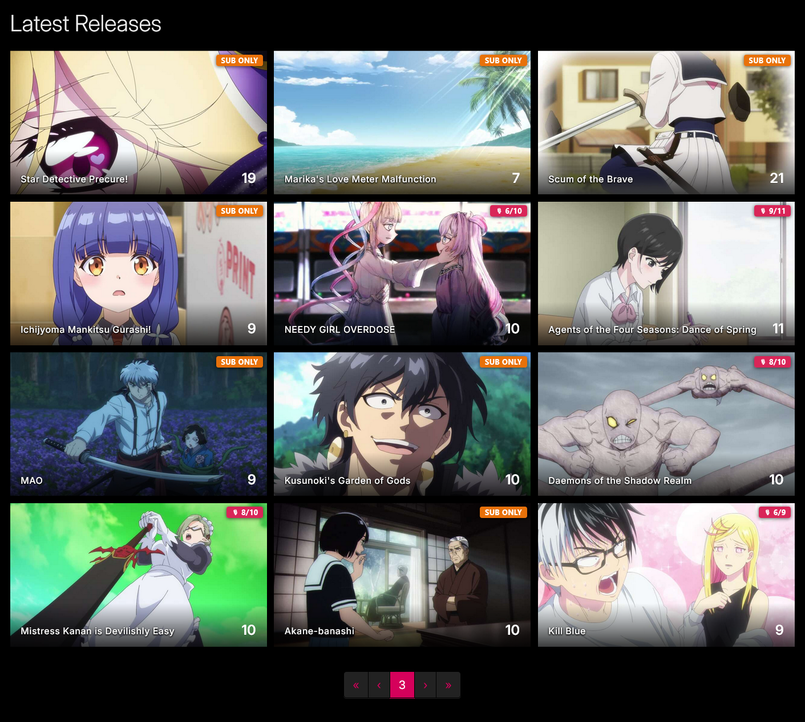
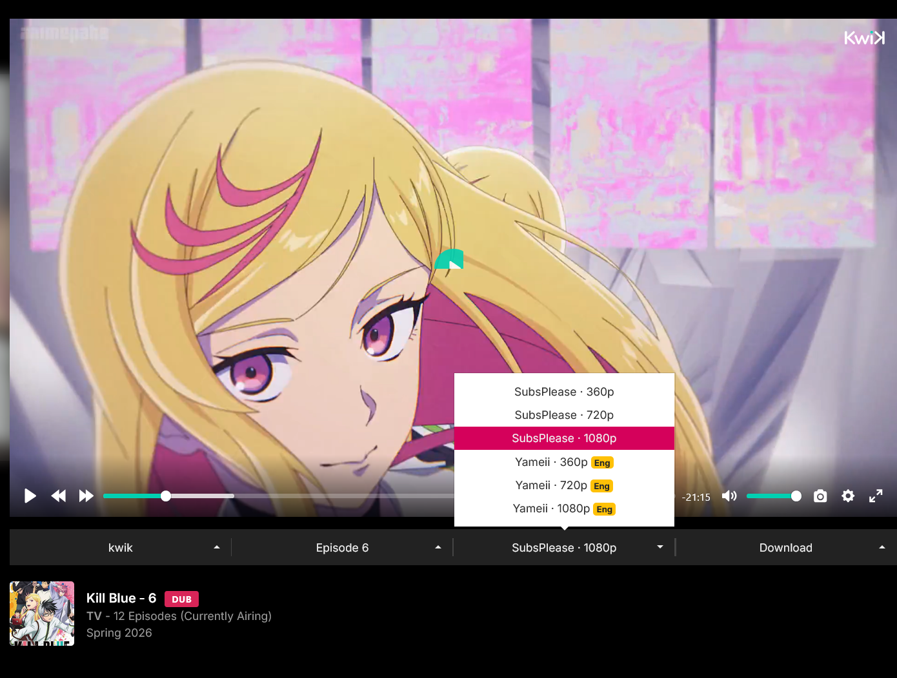
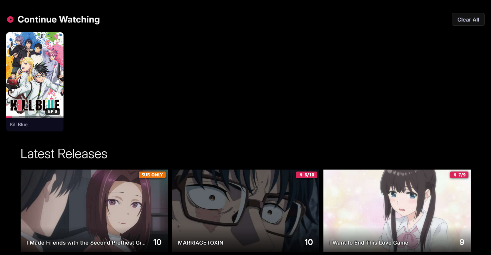
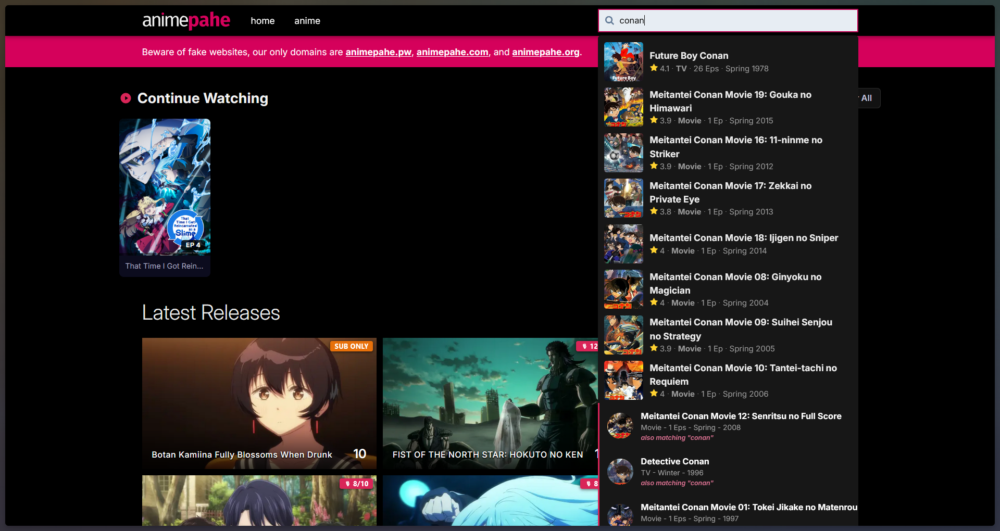

# animepahe Enhancer

A free browser extension that makes watching anime on animepahe a bit nicer. It remembers where you left off, tells you which episodes are dubbed, helps you find shows even if you only know a nickname for them, and can skip openings/endings for you.

  

  
  
  

## Contents

- [What it does](#what-it-does)
- [Screenshots](#screenshots)
- [Install](#install)
- [Want more control?](#want-more-control)
- [Learn more](#learn-more)
- [Contributing, privacy & security](#contributing-privacy--security)

---

## What it does

- **▶ Continue Watching** — Picks up exactly where you stopped, every time. No more hunting for the right episode. [Details&nbsp;→](docs/FEATURES.md#-continue-watching)
- **🎙 DUB Detector** — Puts a badge on every episode that's dubbed, so you don't have to open it to find out. [Details&nbsp;→](docs/FEATURES.md#-dub-detector)
- **🔍 Smart Search** — Finds a show even if you search by a nickname or a title in a different language. [Details&nbsp;→](docs/FEATURES.md#-smart-search)
- **⏭ Intro / Outro Skip** — Skips the opening and ending automatically, or gives you a one-click Skip button. [Details&nbsp;→](docs/FEATURES.md#-intro--outro-skip)

Each feature can be turned on or off separately from the extension's popup, and everything runs locally in your browser — see [PRIVACY.md](PRIVACY.md) for exactly what leaves your device and why.

<a href="#top">↑ Back to top</a>

---

## Screenshots

<a href="#top">↑ Back to top</a>

---

## Install

<!-- Widget source: docs/widgets/firefox.md — edit there, then copy the block below -->

  
   
  Free · takes about 10 seconds · no account needed

<!-- Widget source: docs/widgets/chrome.md — edit there, then copy the block below -->

  

<!-- Widget source: docs/widgets/edge.md — edit there, then copy the block below -->

  

| Browser                      | Where to get it                                                                            | Notes                                        |
| ------------------------------ | ---------------------------------------------------------------------------------------------- | ----------------------------------------------- |
| **Firefox**                  | [Firefox Add-ons](https://addons.mozilla.org/en-US/firefox/addon/animepahe-enhancer/)         | Ready to install right now                    |
| **Chrome**                   | Chrome Web Store                                                                             | **Release date: TBA** — not published yet     |
| **Edge**                     | [docs/EDGE.md](docs/EDGE.md) — manual install recommended over the store for now | ⚠️ Store listing is stuck on v0.0.2, missing most current features |
| Any other Chromium browser   | [GitHub Releases](https://github.com/abdullahkhfb/animepahe-enhancer/releases)                | Manual install — see [docs/DEVELOPMENT.md](docs/DEVELOPMENT.md#loading-the-extension-locally) |

<a href="#top">↑ Back to top</a>

---

## Want more control?

If you like tinkering, the popup has an **Advanced Settings** tab where you can adjust things like cache duration, scan speed, and skip timing — all with plain-language descriptions, so you don't need to touch any code. Everything has a sensible default, so this is entirely optional. [See what's tunable →](docs/FEATURES.md#-advanced-settings)

<a href="#top">↑ Back to top</a>

---

## Learn more

This README keeps things short on purpose. For anything more in-depth:

| Guide                                          | What's in it                                                                 |
| ------------------------------------------------- | ---------------------------------------------------------------------------------- |
| [docs/FEATURES.md](docs/FEATURES.md)           | The full technical detail behind every feature                                    |
| [docs/USAGE.md](docs/USAGE.md)                 | Step-by-step instructions for using each feature and the popup                     |
| [docs/ARCHITECTURE.md](docs/ARCHITECTURE.md)   | How the code is organized, and how to add a new feature or setting                |
| [docs/PERMISSIONS.md](docs/PERMISSIONS.md)     | Exactly what the extension can access, and why                                     |
| [docs/DEVELOPMENT.md](docs/DEVELOPMENT.md)     | Running the extension locally and how releases are published                       |
| [docs/EDGE.md](docs/EDGE.md)                   | The current situation with the Microsoft Edge listing, and how to install anyway   |
| [RELEASE.md](RELEASE.md)                       | Release notes, mirrored from GitHub Releases                                       |
| [docs/STORE_LISTING.md](docs/STORE_LISTING.md) | The description text used on the extension store listings                          |

<a href="#top">↑ Back to top</a>

---

## Contributing, privacy & security

- **Want to help?** Bug reports, ideas, and pull requests are all welcome — see [CONTRIBUTING.md](CONTRIBUTING.md) for how to get started.
- **Curious what data is involved?** See [PRIVACY.md](PRIVACY.md) — the short version is: your data stays on your device, and the few features that do talk to the internet are documented there.
- **Found a security issue?** Please don't open a public issue — see [SECURITY.md](SECURITY.md) for how to report it privately.
- **Community standards:** this project follows the [Code of Conduct](CODE_OF_CONDUCT.md).
- **License:** [MIT](LICENSE) © [abdullahkhfb](https://github.com/abdullahkhfb)

<a href="#top">↑ Back to top</a>

