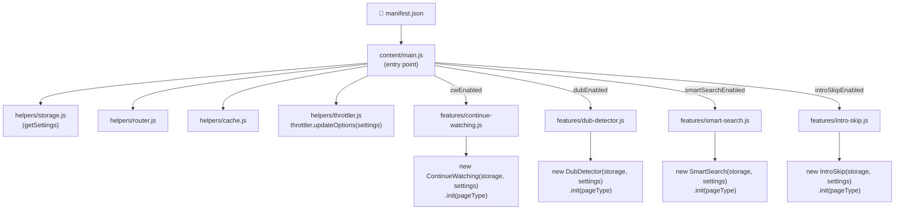
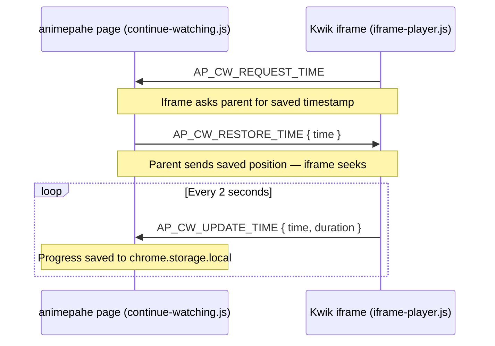
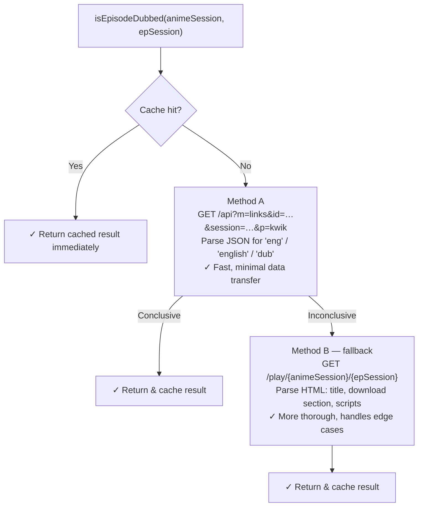
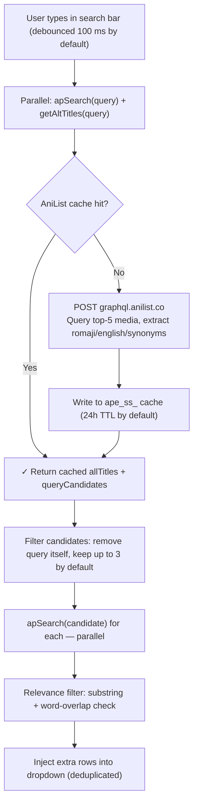

<a name="top"></a>

# Architecture

> How the codebase is put together. For a plain-language overview, see the [main README](../README.md).

## Table of Contents

- [File Structure](#file-structure)
- [How It Works](#how-it-works)
- [Adding a New Feature](#adding-a-new-feature)
- [Adding an Advanced Setting](#adding-an-advanced-setting)

---

## File Structure

```
📦 animepahe-enhancer/
├── ⚙️  manifest.json              # Extension manifest (Manifest V3)
│
├── 📁 content/
│   ├── 📄 main.js                 # Entry point — loads settings, detects page,
│   │                              #   dynamically imports and initializes features
│   ├── 📄 iframe-player.js        # Kwik iframe script — postMessage bridge for
│   │                              #   Continue Watching + Intro/Outro Skip controller
│   │
│   ├── 📁 features/               # One file per feature
│   │   ├── 📄 continue-watching.js  # Continue Watching — home row + player bridge
│   │   ├── 📄 dub-detector.js       # DUB Detector — badges, binary search, cache
│   │   ├── 📄 smart-search.js       # Smart Search — AniList alt-title lookup + dropdown injection
│   │   └── 📄 intro-skip.js         # Intro/Outro Skip — timestamp lookup + range orchestration
│   │
│   └── 📁 helpers/                # Shared helpers imported by any feature
│       ├── 📄 storage.js          # chrome.storage.local wrapper + DEFAULT_SETTINGS
│       │                          #   + ADVANCED_SETTINGS_SCHEMA (drives the popup's panel)
│       ├── 📄 router.js           # Page-type detection from the current URL
│       ├── 📄 cache.js            # DUB cache read/write/GC (configurable TTL)
│       ├── 📄 throttler.js        # RequestThrottler — rate-limiting, jitter, retry
│       │                          #   (tunable at runtime via updateOptions())
│       └── 📄 timestamps-db.js    # open-anime-timestamps dataset access (IndexedDB
│                                  #   cache, ID resolution, episode lookup)
│
├── 📁 popup/
│   ├── 🌐 popup.html              # Settings popup markup (three tabs: Features,
│   │                              #   Advanced Settings, Quick Links)
│   ├── 📄 popup.js                # Slim entry point — wires up the tab bar and
│   │                              #   hands off to each tab's own module
│   ├── 📁 scripts/                # One JS module per tab, plus shared helpers
│   │   ├── 📄 common.js           #   Tab switching, collapsible sections, button
│   │   │                          #   feedback — shared by every tab (DRY)
│   │   ├── 📄 features.js         #   Features tab logic
│   │   ├── 📄 advanced.js         #   Advanced Settings tab logic
│   │   └── 📄 links.js            #   Quick Links tab logic
│   └── 📁 styles/                 # One CSS file per tab, plus shared base styles
│       ├── 🎨 common.css          #   Reset, header, tab bar, panel shell, notice
│       ├── 🎨 features.css
│       ├── 🎨 advanced.css
│       └── 🎨 links.css
│
├── 📁 icons/
│   ├── 🖼️  icon16.{png,svg}
│   ├── 🖼️  icon48.{png,svg}
│   ├── 🖼️  icon128.{png,svg}
│   └── 🖼️  intro-skip.svg         # Intro/Outro Skip feature icon
│
├── 📁 docs/                       # Detailed documentation (this file lives here)
│   └── 📁 widgets/                # Reusable install-prompt snippets for README.md
│
└── 📁 .github/
    └── 📁 workflows/
        └── ⚙️  deploy.yml         # CI/CD: Unified production deployment engine
```

<p align="right"><a href="#top">↑ Back to top</a></p>

## How It Works

### Module loading — no bundler required

`content/main.js` is the sole entry point registered in `manifest.json`. It uses the browser's native dynamic `import()` with `chrome.runtime.getURL()` to load feature and utility modules at runtime:



Feature files are listed in `web_accessible_resources` so the extension runtime can import them. No bundler, no build step — plain ES2020+ modules. Every feature constructor receives the same `settings` object (loaded once via `storage.getSettings()`), so reading a user-tuned value is just `settings.someKey ?? someDefault`.

### Continue Watching — Cross-Frame Communication

animepahe embeds the actual video player in a sandboxed `<iframe>` served from a separate domain (Kwik). Because the iframe and the parent page are on different origins, direct DOM access is impossible. The extension solves this with a **`postMessage` bridge**:



**Message types:**

| Type                 | Direction       | Payload                                                          | Description                                      |
| --------------------- | ---------------- | ------------------------------------------------------------------ | --------------------------------------------------- |
| `AP_CW_REQUEST_TIME` | iframe → parent | —                                                                | Iframe asks parent for saved timestamp           |
| `AP_CW_RESTORE_TIME` | parent → iframe | `{ time: number }`                                               | Parent sends saved position; iframe seeks        |
| `AP_CW_UPDATE_TIME`  | iframe → parent | `{ time, duration }`                                             | Iframe reports current playback position         |
| `AP_IS_SET_RANGES`   | parent → iframe | `{ ranges, autoSkip, pollMs, buttonAutoHideMs, showHighlights }` | Parent sends intro/outro skip ranges to iframe   |
| `AP_IS_SEEK`         | parent → iframe | `{ time: number }`                                               | Parent instructs iframe to seek (reserved)       |
| `AP_IS_READY`        | iframe → parent | —                                                                | Iframe signals it's ready to receive skip ranges |

<p align="right"><a href="#top">↑ Back to top</a></p>

### DUB Detector — Binary Search

Dubbed episodes on animepahe always occupy a **contiguous leading block** (episodes 1, 2, 3 … N are dubbed; the rest are sub-only). The detector exploits this property:

1. Check episode 1 — if not dubbed, stop (0 dubbed).
2. Check the last episode — if dubbed, all are dubbed.
3. Otherwise, binary-search the boundary, performing only **O(log n)** API calls.

Detection itself uses two methods tried in sequence:



<p align="right"><a href="#top">↑ Back to top</a></p>

### Storage Schema

All settings and cache data are stored in `chrome.storage.local`. The large open-anime-timestamps database is stored in **IndexedDB** (see the [Intro / Outro Skip](FEATURES.md#-intro--outro-skip) feature page).

| Key                     | Type                  | Description                                                                                                                                                                                                                                                                                                                                    |
| ------------------------- | ----------------------- | -------------------------------------------------------------------------------------------------------------------------------------------------------------------------------------------------------------------------------------------------------------------------------------------------------------------------------------------------- |
| `ape_settings`          | `object`              | `{ cwEnabled, dubEnabled, smartSearchEnabled, introSkipEnabled, ...23 advanced tunables }` — feature toggles plus every Advanced Settings value (cache TTL, throttling, batch sizes, debounce timings, skip durations, etc.). The full list of keys, labels, bounds, and defaults lives in `ADVANCED_SETTINGS_SCHEMA` in `helpers/storage.js`. |
| `ape_cw_v1`             | `string` (JSON array) | Continue Watching list, up to 24 entries by default (configurable)                                                                                                                                                                                                                                                                             |
| `d2_{epSession}`        | `string`              | DUB result cache for a single episode. Format: `"{timestamp}\|{boolean}"`                                                                                                                                                                                                                                                                      |
| `h2_{animeSession}`     | `string`              | DUB stats cache for a home card. Format: `"{timestamp}\|{dubs, total}"`                                                                                                                                                                                                                                                                        |
| `ape_ss_{query}`        | `string`              | Smart Search AniList cache for a normalised query. Stores `allTitles` and `queryCandidates` arrays.                                                                                                                                                                                                                                            |
| `ape_isid_v1_{session}` | `string` (JSON)       | Intro Skip ID resolution cache — maps an animepahe `animeSession` to its resolved AniDB/AniList/MAL IDs. TTL is configurable (default 7 days).                                                                                                                                                                                                |
| `ape_is_db_meta`        | `object`              | Metadata for the open-anime-timestamps database cached in IndexedDB: `{ fetchedAt, sizeBytes, etag }`. Shared between the content script and popup (the popup can't access the content script's IndexedDB).                                                                                                                                  |

Cache entries prefixed `d2_`, `h2_`, and `ape_ss_` all expire after the same configurable cache-duration setting (24 hours by default) and are garbage-collected automatically. The Intro Skip ID cache (`ape_isid_`) has its own independent TTL as described above. The timestamps database in IndexedDB is refreshed on a separate configurable schedule (7 days by default).

<p align="right"><a href="#top">↑ Back to top</a></p>

### Smart Search — AniList Alt-Title Lookup

Smart Search enriches the native animepahe dropdown by resolving alternative titles through the AniList GraphQL API:



Key design decisions:

- **Debounce (100 ms by default, configurable)** prevents API calls on every keystroke.
- **Normalisation** (`norm()`) strips punctuation and lowercases before any comparison.
- **Relevance filter** (`isRelevant()`) uses substring inclusion and an 80 % alt-word / 50 % item-word overlap ratio.
- **Deduplication** suppresses any result whose normalised title already appears in the native dropdown.
- **Stale-query guard** — if the input changes while awaiting results, the injection is silently aborted.

<p align="right"><a href="#top">↑ Back to top</a></p>

### RequestThrottler

All outbound DUB detection requests are routed through `helpers/throttler.js`, which exports a shared `throttler` singleton (and the `RequestThrottler` class for custom instances). It provides:

- **Concurrency cap** — limits simultaneous in-flight fetches (`maxConcurrent`, default 6)
- **Interval + jitter** — enforces a minimum gap between request launches with ± random variation to avoid burst patterns
- **Exponential back-off with retry** — on HTTP 429, 503, or 403 (and Cloudflare HTML rate-limit pages), the request is re-queued and the entire drain loop backs off for `baseBackoff × 2ⁿ` ms (up to `maxRetries` attempts)
- **`pendingCount` getter** — used by the DUB Detector's ETA pill to display live scan progress
- **`updateOptions(opts)`** — applies new values to the live singleton without dropping anything already queued or in-flight; `main.js` calls this once on startup with the user's Advanced Settings → Network Throttler values

<p align="right"><a href="#top">↑ Back to top</a></p>

## Adding a New Feature

1. Create `content/features/my-feature.js` and export a class that satisfies the feature contract:

```js
export class MyFeature {
  constructor(storage, settings) {
    /* settings is the fully-merged object from storage.getSettings() */
  }
  async init(pageType) {
    /* ... */
  }
}
```

2. Add a settings key and default in `content/helpers/storage.js`:

```js
export const DEFAULT_SETTINGS = {
  cwEnabled: true,
  dubEnabled: true,
  smartSearchEnabled: true,
  introSkipEnabled: true,
  myFeatureEnabled: true, // ← add here
};
```

3. Register the feature in `content/main.js`:

```js
const FEATURES = [
  // ...existing entries...
  {
    module: "content/features/my-feature.js",
    export: "MyFeature",
    enabled: settings.myFeatureEnabled,
  },
];
```

That's it — no other files need to change.

<p align="right"><a href="#top">↑ Back to top</a></p>

## Adding an Advanced Setting

The Advanced Settings tab in the popup isn't hand-written markup — it's generated entirely from one schema, so adding a new tunable doesn't touch `popup.html` or any popup CSS/JS.

1. Add an entry to `ADVANCED_SETTINGS_SCHEMA` in `content/helpers/storage.js`, under an existing `group` or a new one:

```js
{
  key: "myNewTunable",
  label: "My new tunable",
  desc: "What this controls, in plain language.",
  min: 0,
  max: 100,
  step: 1,
  default: 10,
}
```

2. Read it wherever it's needed, with a fallback to that same default:

```js
this._myValue = settings.myNewTunable ?? 10;
```

The popup automatically renders a labeled input, description, and its own **↺ reset** button for the new setting, and folds it into **Reset All Advanced Settings** — for free.

<p align="right"><a href="#top">↑ Back to top</a></p>
