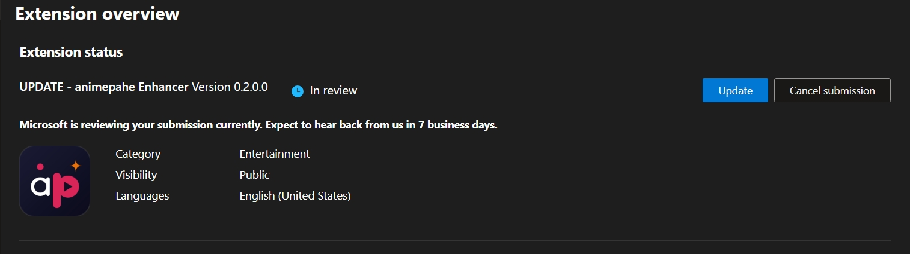

# Microsoft Edge — Current Status

## Short version

**The Edge Add-ons store listing is not usable right now.** Please don't install it from there. Use the manual install steps below instead — it only takes a minute and works exactly the same as the store version.

  
   
  The current state of the Edge Add-ons listing.

## What's going on

The extension is still automatically submitted to the Microsoft Edge Add-ons dashboard on every release (see [`deploy.yml`](../.github/workflows/deploy.yml) and [Releasing a New Version](DEVELOPMENT.md#releasing-a-new-version)), but the public listing itself isn't in a working state. We're aware of this and are working through Microsoft's Partner Center to sort it out. There's no fixed timeline yet — this page will be updated as soon as that changes.

If you were sent here from the main README or the popup's Quick Links tab, that's expected: we'd rather point you to a working install method than let you hit a broken store page.

## Installing manually instead

This gets you the exact same extension you'd get from the store — just loaded locally instead of through Edge's store pipeline.

1. Download the latest `Animepahe-Enhancer.zip` from the [GitHub Releases](https://github.com/abdullahkhfb/animepahe-enhancer/releases) page.
2. Unzip it somewhere you won't accidentally delete it (Edge needs to keep reading from that folder).
3. Go to `edge://extensions` in your address bar.
4. Turn on **Developer mode** (toggle, usually bottom-left or top-right of the page).
5. Click **Load unpacked** and select the unzipped folder.

The extension will now behave identically to a store install — it just needs to be reloaded manually if you move or delete the folder, and Edge may occasionally show a "Developer mode extensions" warning banner, which is expected and harmless.

## Prefer a different browser?

The [Firefox Add-on](https://addons.mozilla.org/en-US/firefox/addon/animepahe-enhancer/) listing is fully live and is the easiest way to get the extension without any manual steps. See the [main README](../README.md#install) for all current install options.

<a href="#top">↑ Back to top</a>

