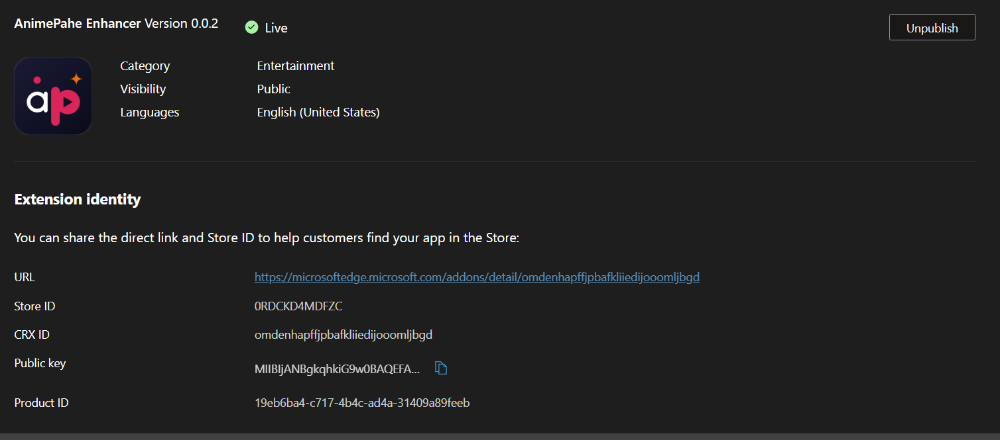
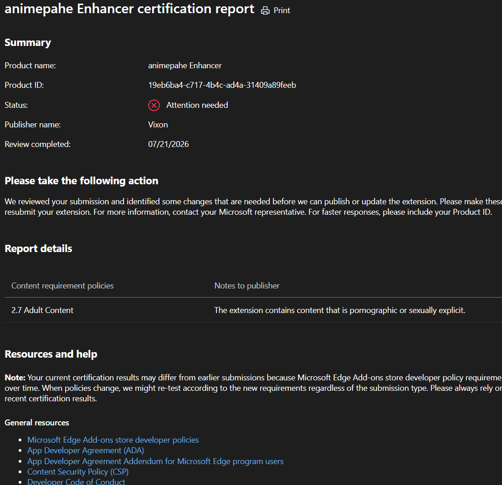

# Microsoft Edge — Current Status

## Short version

**The Edge Add-ons listing is live, but it's stuck on version 0.0.2 — a very early build that predates most of what the extension does today.** If you install from the Edge store right now, don't expect Smart Search, Intro/Outro Skip, or the current popup to be there; you may hit bugs that have long since been fixed too. **Microsoft has since told us the update can't be approved at all**, for reasons unrelated to version — see below. **We'd recommend the manual install further down over the store listing**, and we don't currently expect that to change.

  
   
  The listing itself: live, but stuck on version 0.0.2.

## What's going on

The version currently live (0.0.2) passed review fine. The problem is with the **update** submitted after it — Microsoft's certification review returned **"Attention needed"** and flagged that submission under one policy:

  
   
  The certification report for the blocked update.

| Field            | Value                                                                       |
| ---------------- | --------------------------------------------------------------------------- |
| Status           | ⚠️ Attention needed                                                         |
| Policy cited     | 2.7 Adult Content                                                           |
| Reviewer's note  | "The extension contains content that is pornographic or sexually explicit." |
| Review completed | 2026-07-21                                                                  |

The extension's own code doesn't include, generate, or display any adult content — it only adds UI features (progress tracking, dub badges, search, skip buttons) on top of whatever animepahe.pw itself shows a visitor. We asked Microsoft to clarify whether the flag was about a specific submitted asset or about the source site in general. On 2026-07-24, they gave a direct answer:

> "The extension works on/is designed for a website that contains content that is pornographic or sexually explicit. Product submitted to the store cannot be of sexually explicit or pornographic content nature or purpose."
> — Microsoft Store Certification Team

**This is a final determination, not a request for more info.** Microsoft isn't objecting to a specific screenshot or description anymore — they're saying no version of this extension can be approved, because of what site it operates on rather than anything the extension itself adds or contains. That's a different, harder blocker than the original review note suggested.

**What this means practically:**

- We don't expect the pending update to get approved, and don't plan to keep resubmitting it as-is.
- The **currently live v0.0.2 listing could, in principle, be pulled** if Microsoft re-reviews it under the same reasoning — we have no indication that's imminent, but it's not something we can rule out or prevent.
- The same reasoning would very plausibly apply to a **future Chrome Web Store submission** too, since Google's content policies raise similar concerns about extensions built around adult-content-adjacent sites. We haven't submitted to Chrome yet and don't have a Google-specific answer, but we're not assuming this is an Edge-only problem.
- **Firefox (AMO) has already reviewed and approved the extension** without raising this, so for now Firefox remains the most reliable store option.

If you've gotten a browser extension approved for a similar general-purpose-tool-on-an-adult-adjacent-site situation, [open an issue](https://github.com/abdullahkhfb/animepahe-enhancer/issues) — we'd like to know what worked.

If you were sent here from the main README or the popup's Quick Links tab, that's expected: we wanted to explain the version gap and the reasoning behind it, rather than leave people wondering why Edge is behind.

## Installing manually instead

Given both the version gap and Microsoft's determination above, this is the recommended way to get the extension on Edge for the foreseeable future — not just a stopgap while an update clears review. It gets you the exact current version, just loaded locally instead of through Edge's store pipeline.

1. Download the latest `Animepahe-Enhancer.zip` from the [GitHub Releases](https://github.com/abdullahkhfb/animepahe-enhancer/releases) page.
2. Unzip it somewhere you won't accidentally delete it (Edge needs to keep reading from that folder).
3. Go to `edge://extensions` in your address bar.
4. Turn on **Developer mode** (toggle, usually bottom-left or top-right of the page).
5. Click **Load unpacked** and select the unzipped folder.

The extension will now behave identically to a store install — it just needs to be reloaded manually if you move or delete the folder, and Edge may occasionally show a "Developer mode extensions" warning banner, which is expected and harmless. If you install this way, you may want to disable/remove the store version first to avoid running both at once.

## Prefer a different browser?

The [Firefox Add-on](https://addons.mozilla.org/en-US/firefox/addon/animepahe-enhancer/) listing is fully live and up to date, and is the easiest way to get the current version without any manual steps. See the [main README](../README.md#install) for all current install options.

<a href="#top">↑ Back to top</a>

