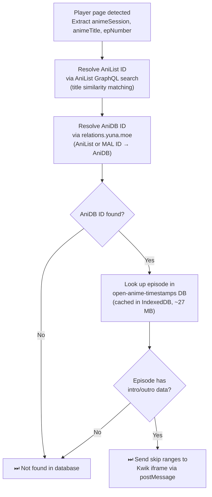

# Features (in depth)

> This page has the full technical detail for every feature. If you just want the short version, see the [main README](../README.md#what-it-does).

## Table of Contents

- [Continue Watching](#-continue-watching)
- [DUB Detector](#-dub-detector)
- [Smart Search](#-smart-search)
- [Intro / Outro Skip](#-intro--outro-skip)
- [Advanced Settings](#-advanced-settings)

---

## ▶ Continue Watching

Never lose your place again. animepahe Enhancer tracks your exact playback position for every episode you watch and surfaces a **Continue Watching** row directly on the animepahe home page.

- Automatically saves your progress every 2 seconds by default (configurable) while the video plays
- Resumes exactly where you left off when you revisit an episode
- Displays a visual progress bar on each card in the Continue Watching grid
- Supports up to **24 episodes** by default in your watch history (FIFO — oldest entries are pruned automatically; this limit is configurable)
- Individual episodes can be removed with a hover-reveal ✕ button
- The entire list can be cleared in one click from the popup or the home page
- Works across all official animepahe mirror domains

<a href="#top">↑ Back to top</a>

## 🎙 DUB Detector

Instantly know which episodes are available in English dub without opening them. The DUB Detector automatically scans anime listings, episode pages, and the home feed and overlays colour-coded badges:

| Location        | Badge colour                                       | Example                        |
| ---------------- | --------------------------------------------------- | ------------------------------- |
| Episode list    | Pink `DUB` badge / Orange `SUB ONLY` badge          | Dubbed or sub-only episode      |
| Home page cards | Pink `N/total` badge / Orange `SUB ONLY`            | `12/24` dubbed out of 24 total  |
| Player page     | Inline `DUB` badge / `SUB ONLY` badge on the title  | Confirmation when watching      |

Detection uses a two-method strategy with a local cache (24 hours by default, configurable) to minimise network requests:

1. **Lightweight JSON API check** — hits animepahe's `/api?m=links` endpoint
2. **HTML page fallback** — parses the play page if the API check is inconclusive

A smart **binary search** algorithm is used on episode lists, since dubbed episodes always form a contiguous block from the beginning of a series. This cuts the number of network requests from O(n) to O(log n). The number of parallel probes and the delay between scan batches are both configurable.

All network requests are routed through a **`RequestThrottler`** — a built-in rate-limiting layer that enforces configurable concurrency limits, per-request jitter, and exponential back-off with automatic retry on HTTP 429/503/403 responses, keeping scans polite without sacrificing speed. Every one of these knobs is exposed in the popup's [Advanced Settings](#-advanced-settings) panel.

<a href="#top">↑ Back to top</a>

## 🔍 Smart Search

Can't find an anime because you only know its English dub title, a common nickname, or a romanized spelling that doesn't match animepahe's catalogue? Smart Search fixes that by querying [AniList](https://anilist.co) for every alternative title associated with your search term and running parallel searches for each one — all without leaving the search bar.

- Activates automatically as you type (debounced 100 ms by default) — no extra interaction required
- Fetches alternative titles (romaji, English, synonyms) from the AniList GraphQL API for the top matching anime
- Runs additional searches on animepahe using each candidate title and merges the results
- Extra results appear **above** the native dropdown, clearly labelled with a pink `also known as "…"` tag and a left-side accent border
- Duplicate titles already shown by animepahe's native search are automatically suppressed
- Relevance filtering ensures only genuinely related titles are injected (word-overlap + substring checks)
- AniList lookup results are cached locally for 24 hours by default (storage prefix `ape_ss_`) — shares the same configurable cache-duration setting as the DUB Detector

<a href="#top">↑ Back to top</a>

## ⏭ Intro / Outro Skip

Automatically skip anime openings and endings — or show a manual Skip button when you're ready. This feature uses the community-maintained [open-anime-timestamps](https://github.com/jonbarrow/open-anime-timestamps) dataset (~27 MB, cached locally in IndexedDB) to look up intro and outro timestamps per episode.

- **Two modes:**
  - **Auto-skip** (opt-in): The player automatically jumps past intros and outros without any interaction
  - **Manual skip** (default): A styled **Skip Intro** / **Skip Outro** button appears on top of the video when the playback enters an intro or outro range; clicking it seeks past the segment
- **Progress bar highlights**: Coloured segments are drawn directly on the Kwik player's scrubber — blue for intros, orange for outros, purple for recaps — giving you a visual map of non-story content at a glance
- **ID resolution chain**: To bridge animepahe's session-based URLs to AniDB IDs, the extension queries the AniList GraphQL API for a title match, then resolves the AniDB ID via [relations.yuna.moe](https://relations.yuna.moe). Results are cached per anime session
- **Smart defaults**: When the database only provides a start time (no end), the intro/outro is extended by a configurable default duration (90 seconds by default), so the skip button always has a valid target
- **Fullscreen-aware**: The skip button and progress bar highlights work correctly in both normal and fullscreen playback, automatically reparenting into the fullscreen element
- **Status pill**: A floating pill in the bottom-right corner of the player page shows real-time lookup progress and the final result (e.g., `⏭ Intro/Outro (database): OP ✓ · ED ✓`)
- **Popup controls**: Toggle the feature on/off, see whether the timestamps database is currently cached, or clear all cached data (which forces a fresh download next time you visit a player page)

The timestamp resolution pipeline for a single episode:

<a href="#top">↑ Back to top</a>

## ⚙ Advanced Settings

For anyone who wants to fine-tune exactly how the extension behaves, every internal timing, caching, and request-throttling value is exposed in a collapsible **Advanced Settings** tab inside the popup — no code editing required.

| Group                  | What's tunable                                                                                                                             |
| ----------------------- | --------------------------------------------------------------------------------------------------------------------------------------------- |
| **Continue Watching**  | Max saved entries · cards shown before "Show More"                                                                                          |
| **DUB Detector**       | Cache duration · binary-search probe count · delay between scan batches · homepage batch size                                              |
| **Network Throttler**  | Min request interval · jitter · max concurrent requests · max retries · base backoff                                                        |
| **Smart Search**       | Minimum query length · debounce delay · max alternate titles queried · synonym query delay                                                  |
| **Player**             | Progress-save interval                                                                                                                       |
| **Intro / Outro Skip** | Auto-skip toggle · progress bar highlights · skip button auto-hide · poll interval · default OP/ED duration · timestamp DB refresh interval · ID lookup cache duration |

- Every group is collapsed by default so the tab stays short — click a group's header to expand it
- Each setting has its own plain-language description, a numeric input clamped to a sane range, and an individual **↺ reset** button
- Edits are staged as you type — nothing is saved until you press **Apply Changes** at the bottom of the tab
- A **Reset All Advanced Settings** button restores every tunable above to its default in one click — without touching your feature toggles
- Changes persist across browser restarts and (like the feature toggles) need a page reload to take effect

<a href="#top">↑ Back to top</a>

